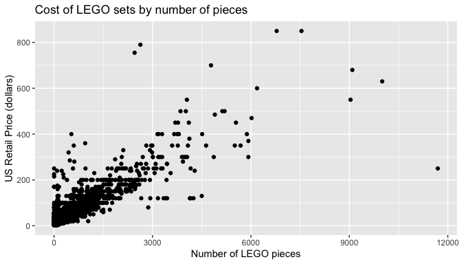

# <a href='https://github.com/jbryer/brickset'></a> brickset: An R Package to Interface with the Brickset API for Getting Data About LEGO sets

<!-- badges: start -->

[](https://github.com/jbryer/brickset/actions/workflows/R-CMD-check.yaml)
[](https://github.com/jbryer/brickset)
[](https://cran.r-project.org/package=brickset)
[](https://cran.r-project.org/web/checks/check_results_brickset.html)<!-- badges: end -->

**Author:** Jason Bryer, Ph.D. <jason@bryer.org>  
**Website:** <https://jbryer.github.io/brickset/>

This package provides functions to access data about
[LEGO](https://www.lego.com/) sets from the
[Brickset](https://brickset.com/) website. The package also contains a
`data.frame` with all LEGO sets (n = 18,455) from 1970 through 2022.
This data set was created using the `getSets` function and it is
recommended that you use this data frame to reduce the number of API
calls. See the
[build.R](https://github.com/jbryer/PSAboot/blob/master/build.R) script
for how the data frame was created. Information about the variables is
included below.

## Installation

You can download from CRAN using:

``` r
install.packages('brickset')
```

Or the latest development version using the `remotes` package:

``` r
remotes::install_github('jbryer/brickset')
```

## Brickset API

To use the Brickset API, you must first create a [Brickset
account](https://brickset.com/signup) and request an [API
key](https://brickset.com/tools/webservices/requestkey). The full
Brickset API documentation is available here:
<https://brickset.com/article/52664/api-version-3-documentation>

Most of the functions require a Brickset username, password, and API
key. You can pass these as parameters, or you can set these options:

``` r
options(brickset_key = 'YOUR_API_KEY',
        brickset_username = 'YOUR_USERNAME',
        brickset_password = 'YOUR_PASSWORD')
```

The `checkKey` function will verify that your API key is valid:

``` r
brickset::checkKey()
#> [1] TRUE
```

You can check your API usage with the `getKeyUsageStats` function.

``` r
brickset::getKeyUsageStats()
#>              dateStamp count
#> 1 2023-03-30T00:00:00Z     3
#> 2 2023-03-24T00:00:00Z     2
#> 3 2023-03-23T00:00:00Z     2
#> 4 2023-03-22T00:00:00Z    16
#> 5 2023-03-21T00:00:00Z     2
```

The `getSets` function returns all LEGO sets from the given year.

``` r
sets2021 <- brickset::getSets(2021)
head(sets2021, n = 3)
#>   setID                     name year theme   themeGroup
#> 1 31026           Police Station 2021 Icons Model making
#> 2 31754 Volkswagen T2 Camper Van 2021 Icons Model making
#> 3 31025           Flower Bouquet 2021 Icons Model making
#>                       subtheme category released pieces minifigs
#> 1 Modular Buildings Collection   Normal     TRUE   2923        5
#> 2                     Vehicles   Normal     TRUE   2207       NA
#> 3         Botanical Collection   Normal     TRUE    756       NA
#>                         bricksetURL rating reviewCount packagingType
#> 1 https://brickset.com/sets/10278-1    4.4           4           Box
#> 2 https://brickset.com/sets/10279-1    4.1           0           Box
#> 3 https://brickset.com/sets/10280-1    4.3           3           Box
#>     availability agerange_min US_retailPrice US_dateFirstAvailable
#> 1 LEGO exclusive           18         199.99  2021-01-02T00:00:00Z
#> 2 LEGO exclusive           18         179.99  2021-08-02T00:00:00Z
#> 3         Retail           18          59.99  2021-01-02T00:00:00Z
#>   US_dateLastAvailable UK_retailPrice UK_dateFirstAvailable
#> 1                 <NA>         169.99  2021-01-01T00:00:00Z
#> 2 2022-11-12T00:00:00Z         139.99  2021-08-01T00:00:00Z
#> 3                 <NA>          54.99  2021-01-01T00:00:00Z
#>   UK_dateLastAvailable CA_retailPrice CA_dateFirstAvailable
#> 1                 <NA>         269.99  2021-01-02T00:00:00Z
#> 2 2022-11-29T00:00:00Z         249.99  2021-08-03T00:00:00Z
#> 3                 <NA>          79.99  2021-01-02T00:00:00Z
#>   CA_dateLastAvailable DE_retailPrice DE_dateFirstAvailable
#> 1                 <NA>         199.99  2021-01-02T00:00:00Z
#> 2 2022-11-12T00:00:00Z         159.99  2021-08-02T00:00:00Z
#> 3                 <NA>          59.99  2021-01-02T00:00:00Z
#>   DE_dateLastAvailable height width depth weight
#> 1                 <NA>   47.6  57.7  11.8  4.012
#> 2 2022-11-30T00:00:00Z   37.4  57.8  11.2  2.945
#> 3                 <NA>   38.2  26.2   7.1  0.760
#>                                         thumbnailURL
#> 1 https://images.brickset.com/sets/small/10278-1.jpg
#> 2 https://images.brickset.com/sets/small/10279-1.jpg
#> 3 https://images.brickset.com/sets/small/10280-1.jpg
#>                                              imageURL
#> 1 https://images.brickset.com/sets/images/10278-1.jpg
#> 2 https://images.brickset.com/sets/images/10279-1.jpg
#> 3 https://images.brickset.com/sets/images/10280-1.jpg
```

The `getReviews` function will return all reviews for a given set.

``` r
reviews29830 <- brickset::getReviews(29830)
names(reviews29830)
#>  [1] "author"             "datePosted"         "title"             
#>  [4] "review"             "HTML"               "overall"           
#>  [7] "parts"              "buildingExperience" "playability"       
#> [10] "valueForMoney"
```

The `getThemes` and `getSubthemes` returns information about LEGO
themes.

``` r
getThemes() |> head(n = 3)
#>             theme setCount subthemeCount yearFrom yearTo
#> 1    {Unknown IP}        5             0     2023   2023
#> 2       4 Juniors       24             5     2003   2004
#> 3 Action Wheelers        9             0     2000   2001
getSubthemes('Toy Story')
#>       theme          subtheme setCount yearFrom yearTo
#> 1 Toy Story Buildable Figures        2     2010   2010
#> 2 Toy Story     Original Film        2     2010   2010
#> 3 Toy Story       Toy Story 2        3     2010   2010
#> 4 Toy Story       Toy Story 3        8     2010   2010
getYears('Toy Story')
#>       theme year setCount
#> 1 Toy Story 2010       15
```

The `getInstructions` will return a table with the URLs to the building
instructions.

``` r
instructions <- getInstructions(setID = 29830)
instructions
#>                                                                       URL
#> 1 https://www.lego.com/cdn/product-assets/product.bi.core.pdf/6313846.pdf
#> 2 https://www.lego.com/cdn/product-assets/product.bi.core.pdf/6313848.pdf
#> 3 https://www.lego.com/cdn/product-assets/product.bi.core.pdf/6313849.pdf
#> 4 https://www.lego.com/cdn/product-assets/product.bi.core.pdf/6313850.pdf
#>                             description
#> 1 BI 3103, 112+4/65+200G, 10270 V29 1/2
#> 2   BI 3103, 96+4/65+200G,10270 V29 2/2
#> 3   BI 3103, 112+4/65+200G, V39/142 1/2
#> 4    BI 3103, 96+4/65+200G, V39/142 2/2
```

## `legosets` Dataset

The `legosets` data frame contains all LEGO sets (n = 18,455) from 1970
through 2022.

``` r
data("legosets", package = "brickset")
ggplot(legosets, aes(x = year)) + geom_bar() +
    ggtitle('Number of LEGO sets by year') +
    xlab('Year') + ylab('Number of LEGO Sets')
```


``` r
ggplot(legosets, aes(x = pieces, y = US_retailPrice)) + 
    geom_point() +
    ggtitle('Cost of LEGO sets by number of pieces') +
    xlab('Number of LEGO pieces') + ylab('US Retail Price (dollars)')
```



The variables in the `legosets` data frame are:

|                       | Type      | Unique_Values |
|:----------------------|:----------|--------------:|
| setID                 | integer   |         18455 |
| name                  | character |         15372 |
| year                  | integer   |            53 |
| theme                 | character |           154 |
| themeGroup            | character |            16 |
| subtheme              | character |           901 |
| category              | character |             7 |
| released              | logical   |             2 |
| pieces                | integer   |          1403 |
| minifigs              | integer   |            34 |
| bricksetURL           | character |         18455 |
| rating                | numeric   |            31 |
| reviewCount           | integer   |            64 |
| packagingType         | character |            18 |
| availability          | character |            10 |
| agerange_min          | integer   |            16 |
| US_retailPrice        | numeric   |           142 |
| US_dateFirstAvailable | Date      |           881 |
| US_dateLastAvailable  | Date      |          2125 |
| UK_retailPrice        | numeric   |           210 |
| UK_dateFirstAvailable | Date      |           825 |
| UK_dateLastAvailable  | Date      |          1984 |
| CA_retailPrice        | numeric   |           162 |
| CA_dateFirstAvailable | Date      |           641 |
| CA_dateLastAvailable  | Date      |          1808 |
| DE_retailPrice        | numeric   |           155 |
| DE_dateFirstAvailable | Date      |           428 |
| DE_dateLastAvailable  | Date      |          1176 |
| height                | numeric   |           241 |
| width                 | numeric   |           286 |
| depth                 | numeric   |           279 |
| weight                | numeric   |          1046 |
| thumbnailURL          | character |         17420 |
| imageURL              | character |         17420 |

## Code of Conduct

Please note that the brickset project is released with a [Contributor
Code of
Conduct](https://jbryer.github.io/brickset/CODE_OF_CONDUCT.html). By
contributing to this project, you agree to abide by its terms.
