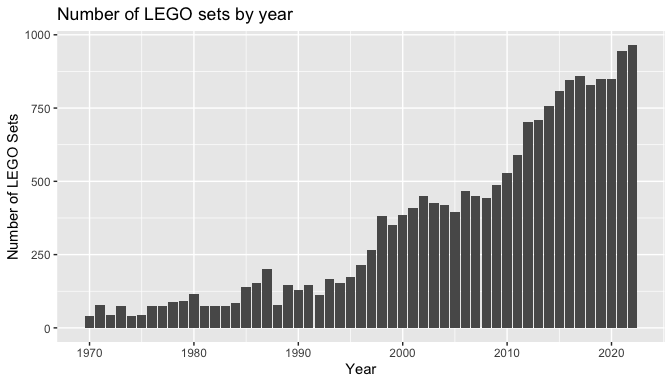

brickset
================

<a href='https://github.com/jbryer/brickset'></a>

# An R package to interface with the Brickset.com API for getting data about LEGO sets

**Author:** Jason Bryer, Ph.D. <jason.bryer@cuny.edu>  
**Website:** <https://github.com/jbryer/brickset>

This package provides functions to access data about
[LEGO](https://lego.com) sets from the [Brickset](https://brickset.com)
website. The package also contains a `data.frame` with all LEGO sets (n
= 16,355) from 1970 through 2020. This data set was created using the
`getSets` function and it is recommended that you use this data frame to
reduce the number of API calls. See the [build.R](build.R) script for
how the data frame was created. Information about the variables is
included below.

The `brickset` package can be installed from Github with the following
command:

``` r
remotes::install_github('jbryer/brickset')
```

## Brickset API

To use the Brickset API, you must first create a [Brickset
account](https://brickset.com/signup) and request an [API
key](http://brickset.com/tools/webservices/requestkey). The full
Brickset API documentation is available here:
<https://brickset.com/article/52664/api-version-3-documentation>

Most of the functions require a Brickset username, password, and API
key. You can pass these as parameters, or you can set these options:

``` r
options(brickset_key = 'YOUR_API_KEY',
        brickset_username = 'YOUR_USERNAME',
        brickset_password = 'YOUR_PASSWORD')
```

The `checkKey` function will verify that your API key is valid:

``` r
brickset::checkKey()
```

    ## [1] TRUE

You can check your API usage with the `getKeyUsageStats` function.

``` r
brickset::getKeyUsageStats()
```

    ##              dateStamp count
    ## 1 2021-02-10T00:00:00Z     9
    ## 2 2021-02-09T00:00:00Z    60
    ## 3 2021-02-08T00:00:00Z    77

The `getSets` function returns all LEGO sets from the given year.

``` r
sets2021 <- brickset::getSets(2021)
head(sets2021, n = 3)
```

    ##   setID           name year          theme   themeGroup             subtheme
    ## 1 31026 Police Station 2021 Creator Expert Model making    Modular Buildings
    ## 2 31025 Flower Bouquet 2021 Creator Expert Model making Botanical Collection
    ## 3 30970    Bonsai Tree 2021 Creator Expert Model making Botanical Collection
    ##   category released pieces minifigs                       bricksetURL rating
    ## 1   Normal     TRUE   2923        5 https://brickset.com/sets/10278-1    4.4
    ## 2   Normal     TRUE    756       NA https://brickset.com/sets/10280-1    4.5
    ## 3   Normal     TRUE    878       NA https://brickset.com/sets/10281-1    4.5
    ##   reviewCount packagingType   availability agerange_min US_retailPrice
    ## 1           2           Box LEGO exclusive           18         199.99
    ## 2           1           Box         Retail           18          49.99
    ## 3           0           Box         Retail           18          49.99
    ##   US_dateFirstAvailable US_dateLastAvailable UK_retailPrice
    ## 1  2021-01-02T00:00:00Z 2021-01-15T00:00:00Z         169.99
    ## 2  2021-01-02T00:00:00Z 2021-01-15T00:00:00Z          44.99
    ## 3  2021-01-02T00:00:00Z 2021-01-15T00:00:00Z          44.99
    ##   UK_dateFirstAvailable UK_dateLastAvailable CA_retailPrice
    ## 1  2021-01-01T00:00:00Z                 <NA>         269.99
    ## 2  2021-01-01T00:00:00Z 2021-01-11T00:00:00Z          69.99
    ## 3  2021-01-01T00:00:00Z 2021-01-11T00:00:00Z          69.99
    ##   CA_dateFirstAvailable CA_dateLastAvailable DE_retailPrice
    ## 1  2021-01-02T00:00:00Z 2021-01-15T00:00:00Z         179.99
    ## 2  2021-01-02T00:00:00Z 2021-01-15T00:00:00Z          49.99
    ## 3  2021-01-02T00:00:00Z 2021-01-15T00:00:00Z          49.99
    ##   DE_dateFirstAvailable DE_dateLastAvailable height width depth weight
    ## 1  2021-01-02T00:00:00Z                 <NA>   47.6  57.7  11.8  4.012
    ## 2  2021-01-02T00:00:00Z 2021-01-12T00:00:00Z     NA    NA    NA     NA
    ## 3  2021-01-02T00:00:00Z 2021-01-12T00:00:00Z     NA    NA    NA     NA
    ##                                         thumbnailURL
    ## 1 https://images.brickset.com/sets/small/10278-1.jpg
    ## 2 https://images.brickset.com/sets/small/10280-1.jpg
    ## 3 https://images.brickset.com/sets/small/10281-1.jpg
    ##                                              imageURL
    ## 1 https://images.brickset.com/sets/images/10278-1.jpg
    ## 2 https://images.brickset.com/sets/images/10280-1.jpg
    ## 3 https://images.brickset.com/sets/images/10281-1.jpg

The `getReviews` function will return all reviews for a given set.

``` r
reviews29830 <- brickset::getReviews(29830)
names(reviews29830)
```

    ##  [1] "author"             "datePosted"         "title"             
    ##  [4] "review"             "HTML"               "overall"           
    ##  [7] "parts"              "buildingExperience" "playability"       
    ## [10] "valueForMoney"

The `getThemes` and `getSubthemes` returns information about LEGO
themes.

``` r
getThemes() %>% head(n = 3)
```

    ##             theme setCount subthemeCount yearFrom yearTo
    ## 1       4 Juniors       24             5     2003   2004
    ## 2 Action Wheelers        9             0     2000   2001
    ## 3     Adventurers       72             4     1998   2003

``` r
getSubthemes('Toy Story')
```

    ##       theme      subtheme setCount yearFrom yearTo
    ## 1 Toy Story        {None}        6     2010   2010
    ## 2 Toy Story Original Film        2     2010   2010
    ## 3 Toy Story   Toy Story 2        3     2010   2010
    ## 4 Toy Story   Toy Story 3        4     2010   2010
    ## 5 Toy Story   Toy Story 4        6     2019   2019

``` r
getYears('Toy Story')
```

    ##       theme year setCount
    ## 1 Toy Story 2010       15
    ## 2 Toy Story 2019        6

The `getInstructions` will return a table with the URLs to the building
instructions.

``` r
instructions <- getInstructions(setID = 29830)
instructions
```

    ##                                                                       URL
    ## 1 https://www.lego.com/cdn/product-assets/product.bi.core.pdf/6313846.pdf
    ## 2 https://www.lego.com/cdn/product-assets/product.bi.core.pdf/6313848.pdf
    ## 3 https://www.lego.com/cdn/product-assets/product.bi.core.pdf/6313849.pdf
    ## 4 https://www.lego.com/cdn/product-assets/product.bi.core.pdf/6313850.pdf
    ##                             description
    ## 1 BI 3103, 112+4/65+200G, 10270 V29 1/2
    ## 2   BI 3103, 96+4/65+200G,10270 V29 2/2
    ## 3   BI 3103, 112+4/65+200G, V39/142 1/2
    ## 4    BI 3103, 96+4/65+200G, V39/142 2/2

## Data Frames

The `legosets` data frame contains all LEGO sets (n = 16,355) from 1970
through 2020.

``` r
data("legosets", package = "brickset")
ggplot(legosets, aes(x = year)) + geom_bar() +
    ggtitle('Number of LEGO sets by year') +
    xlab('Year') + ylab('Number of LEGO Sets')
```

<!-- -->

``` r
ggplot(legosets, aes(x = pieces, y = US_retailPrice)) + 
    geom_point() +
    ggtitle('Cost of LEGO sets by number of pieces') +
    xlab('Number of LEGO pieces') + ylab('US Retail Price (dollars)')
```

<!-- -->

The variables in the `legosets` data frame are:

|                        | Type      | Unique\_Values |
|:-----------------------|:----------|---------------:|
| setID                  | integer   |          16355 |
| name                   | character |          13523 |
| year                   | integer   |             51 |
| theme                  | character |            148 |
| themeGroup             | character |             15 |
| subtheme               | character |            766 |
| category               | character |              7 |
| released               | logical   |              2 |
| pieces                 | integer   |           1273 |
| minifigs               | integer   |             33 |
| bricksetURL            | character |          16355 |
| rating                 | numeric   |             29 |
| reviewCount            | integer   |             63 |
| packagingType          | character |             17 |
| availability           | character |             10 |
| agerange\_min          | integer   |             16 |
| US\_retailPrice        | numeric   |            365 |
| US\_dateFirstAvailable | Date      |            720 |
| US\_dateLastAvailable  | Date      |           1812 |
| UK\_retailPrice        | numeric   |            305 |
| UK\_dateFirstAvailable | Date      |            680 |
| UK\_dateLastAvailable  | Date      |           1693 |
| CA\_retailPrice        | numeric   |            142 |
| CA\_dateFirstAvailable | Date      |            489 |
| CA\_dateLastAvailable  | Date      |           1494 |
| DE\_retailPrice        | numeric   |            136 |
| DE\_dateFirstAvailable | Date      |            309 |
| DE\_dateLastAvailable  | Date      |            945 |
| height                 | numeric   |            190 |
| width                  | numeric   |            220 |
| depth                  | numeric   |            218 |
| weight                 | numeric   |            892 |
| thumbnailURL           | character |          15334 |
| imageURL               | character |          15334 |
