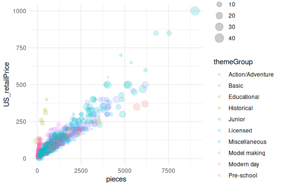
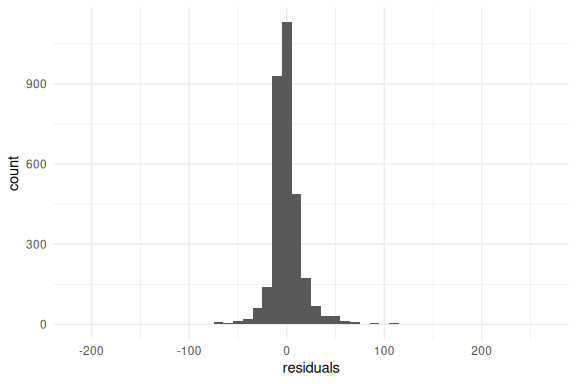

# Predicting Lego Set Price

In this vignette we will show how the `legosets` dataset can be used to
teach basic regression. This, of course, can be extended to other
modeling techniques. To begin, we will filter the data frame to include
sets from the last 10 years and remove any sets with missing values.

``` r
data(legosets)
last_year <- max(legosets$year)
legosets <- legosets |> 
    dplyr::select(year, US_retailPrice, pieces, minifigs, themeGroup) |>
    dplyr::filter(year %in% seq(last_year - 10, last_year)) |>
    na.omit()
```

Our goal is to predict `US_retailPrice` from `pieces` (number of Lego
pieces in the set), `minifigs` (number of mini figures in the set), and
`themeGroup` (the set theme).

``` r
lego_model <- US_retailPrice ~ pieces + minifigs
```

First, let’s plot the data to see if there is a relationship between our
dependent variable and indepedent variables.

``` r
ggplot(legosets, aes(x = pieces, y = US_retailPrice, size = minifigs, color = themeGroup)) +
    geom_point(alpha = 0.2)
```



The contingency table reveals that “Licensed” themes are the largest
category. To help with interpreting our results we will convert the
`themeGroup` variable to a factor and ensure that “Licensed” is our
reference group.

``` r
table(legosets$themeGroup, useNA = 'ifany')
#> 
#> Action/Adventure            Basic      Educational       Historical 
#>              469                4                6                6 
#>           Junior         Licensed    Miscellaneous     Model making 
#>               52             1375              171              130 
#>       Modern day       Pre-school 
#>              742              192
```

``` r
legosets$themeGroup <- as.factor(legosets$themeGroup)
legosets$themeGroup <- relevel(legosets$themeGroup, ref = 'Licensed')
```

Now we can run our linear regression.

``` r
lm_out <- lm(US_retailPrice ~ pieces + minifigs + themeGroup, data = legosets)
summary(lm_out)
#> 
#> Call:
#> lm(formula = US_retailPrice ~ pieces + minifigs + themeGroup, 
#>     data = legosets)
#> 
#> Residuals:
#>      Min       1Q   Median       3Q      Max 
#> -210.529   -7.451   -2.163    5.726  256.691 
#> 
#> Coefficients:
#>                              Estimate Std. Error t value Pr(>|t|)    
#> (Intercept)                 7.107e+00  7.103e-01  10.006  < 2e-16 ***
#> pieces                      9.074e-02  6.746e-04 134.496  < 2e-16 ***
#> minifigs                    1.053e+00  1.630e-01   6.461 1.20e-10 ***
#> themeGroupAction/Adventure -7.913e+00  1.076e+00  -7.353 2.47e-13 ***
#> themeGroupBasic            -2.303e+01  1.007e+01  -2.287 0.022254 *  
#> themeGroupEducational       2.305e+02  8.270e+00  27.875  < 2e-16 ***
#> themeGroupHistorical       -7.890e+00  8.245e+00  -0.957 0.338618    
#> themeGroupJunior            1.239e+00  2.849e+00   0.435 0.663728    
#> themeGroupMiscellaneous    -5.746e+00  1.630e+00  -3.525 0.000429 ***
#> themeGroupModel making     -1.552e+01  1.933e+00  -8.032 1.34e-15 ***
#> themeGroupModern day       -1.647e-01  9.212e-01  -0.179 0.858149    
#> themeGroupPre-school        2.295e+01  1.572e+00  14.601  < 2e-16 ***
#> ---
#> Signif. codes:  0 '***' 0.001 '**' 0.01 '*' 0.05 '.' 0.1 ' ' 1
#> 
#> Residual standard error: 20.1 on 3135 degrees of freedom
#> Multiple R-squared:  0.9186, Adjusted R-squared:  0.9183 
#> F-statistic:  3215 on 11 and 3135 DF,  p-value: < 2.2e-16
```

The adjusted R-squared for our model is 91.8%.

Finally, we can check that our residuals are normally distributed.

``` r
legosets$predicted <- predict(lm_out)
legosets$residuals <- resid(lm_out)
ggplot(legosets, aes(x = residuals)) + geom_histogram(binwidth = 10)
```


